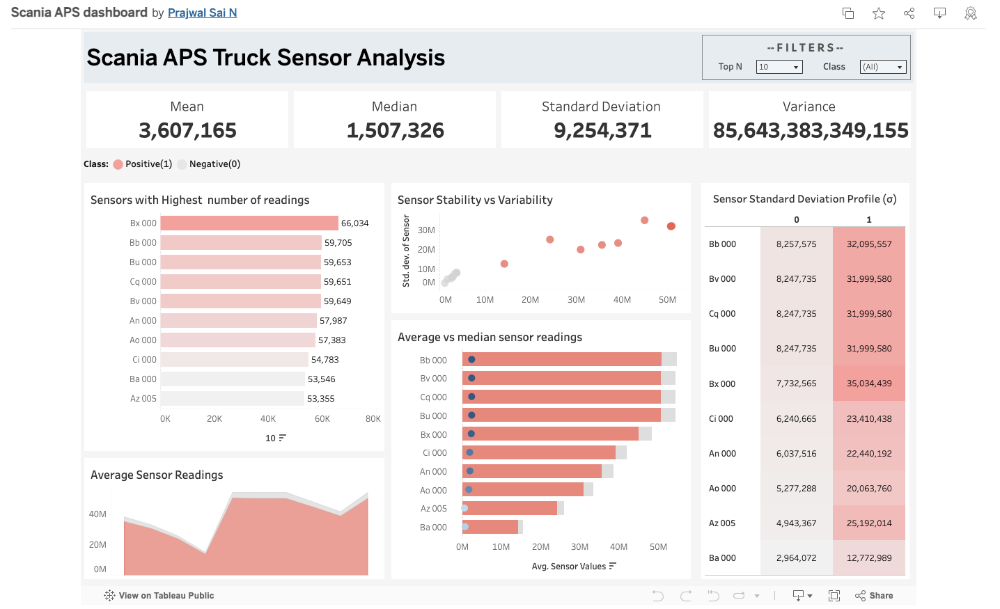
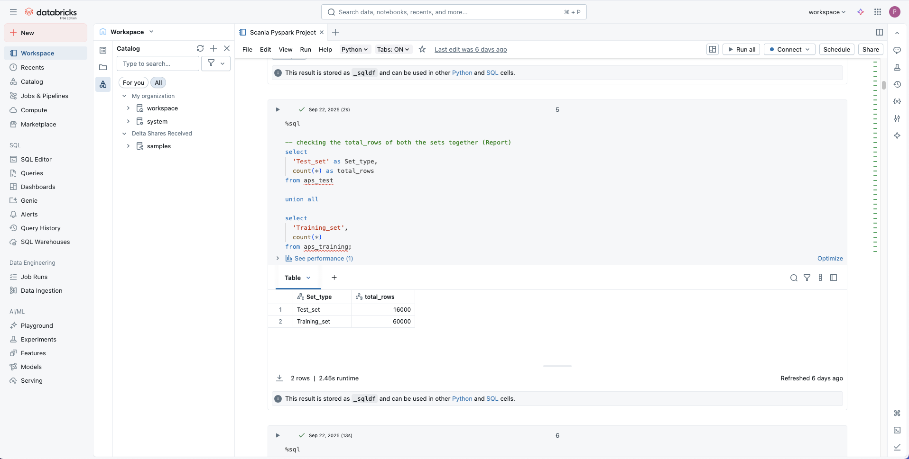
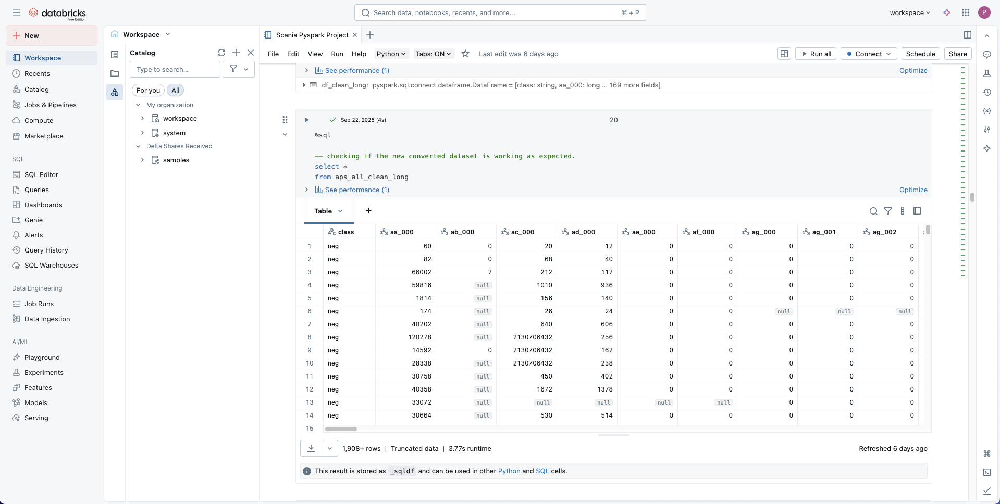
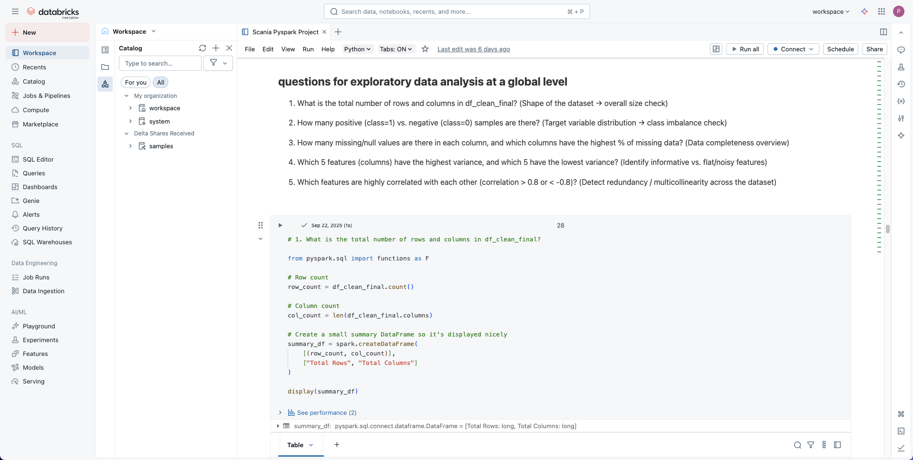
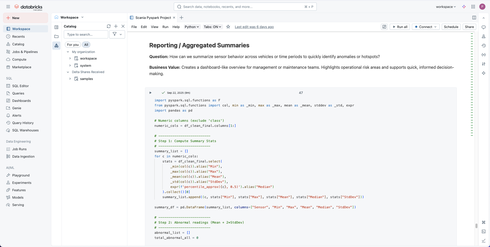

# Pyspark_Scania_aps_anaytics_project

📌 **Introduction**

This project analyzes the **Air Pressure System (APS) dataset from Scania trucks** using **PySpark**.
The primary focus is on **Exploratory Data Analysis (EDA), advanced analytics**, and **data engineering techniques**.

The dataset contains **sensor readings and system indicators** collected from heavy-duty truck, with the target of predicting whether a truck will experience a component failure that requires replacement. Since the dataset consists mostly of numeric fields without clear dimensions, it is treated as a **fact-style dataset** and explored through summarization, aggregations, and statistical profiling.

🎯 **Objectives**

- Approach the dataset from a **data analytics and data warehousing perspective**.
- Demonstrate an **end-to-end pipeline using Databricks (PySpark + SQL)** for data preparation and exploration.
- Perform **EDA** to extract insights in a structured way.
- Replicate and communicate the same insights through **Tableau dashboards** for visualization and storytelling.

🔑 **Emphasis**

- Understanding the dataset structure.
- Cleaning and preparing it for analysis.
- Answering meaningful, business-style questions.
- Building reproducible visualizations that can be shared with stakeholders.

✅ **Outcomes**

By the end of this project, the deliverables will include:
  - A **clean, analytics-ready dataset**.
  - A set of **analytical insights from PySpark in Databricks**.
  - A **Tableau dashboard** that ties everything together.

🔄 **Project Workflow** 

**1. Data Ingestion** 
- Upload the training and test datasets into Databricks.
- Verify data accessibility and structure.

**2. Data Preparation**
- Combine datasets into a unified table.
- Handle missing values, nulls, and inconsistent entries.
- Standardize column names and ensure data quality.

**3. Exploratory Data Analysis (EDA)**
- Generate descriptive statistics for all numeric fields.
- Profile missing data and outliers.
- Explore variable distributions and relationships.

**4. Analytics**
- Frame and answer business-style questions.
- Perform aggregations, comparisons, and trend analysis.
- Extract insights that can guide decision-making.

**5. Visualization** 
- Export cleaned datasets from Databricks.
- Build Tableau dashboards to replicate and present the insights.
- Use charts and summaries to tell a structured data story.

🗂️ **Project Overview** 

This repository contains the full workflow of the project — *unfortunately I cannot upload the raw files to github as it is over 50MB. You can find the data on kaggle!

- **[README - Data Cleaning]** → Details of the data cleaning steps we performed.  
- **[README - SQL Queries]** → Explanation of SQL queries and logic used.  
- **[README - Tableau]** → Dashboarding and visualization details.  

Refer to each individual README to understand every step in detail.

## 📊 Tableau Visualization

Tableau Visualization link to Tableau public-- https://public.tableau.com/app/profile/prajwal.sai6564/viz/ScaniaAPSdashboard/ScaniaAPSDashboard?publish=yes

## 🧪 Databricks Screenshots

